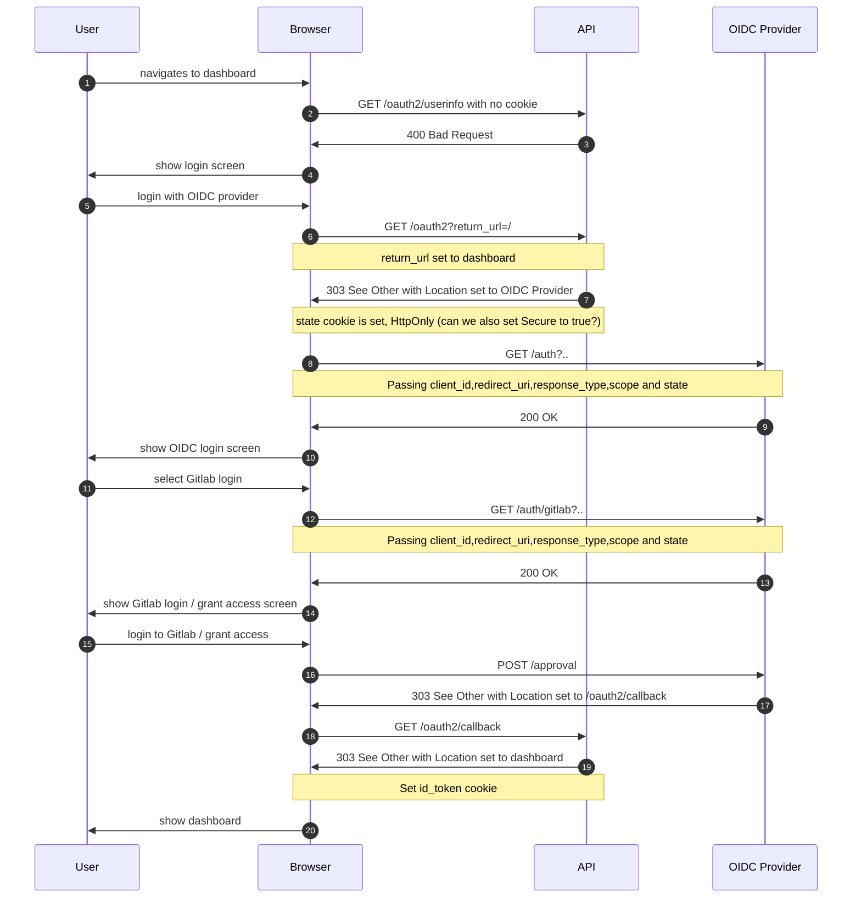

# Auth

There are two authentication flows currently supported in Weave GitOps Core:
1. OIDC (requires an OIDC provider)
1. Cluster user

## OIDC

Endpoints:
- 2: /oauth2/userinfo calls UserInfo() handler
- 6: /oauth2 calls OAuth2Flow() handler
- 18: /oauth2/callback calls Callback() handler

Notes:
- 3: This should return 401 Unauthorized

## Cluster user